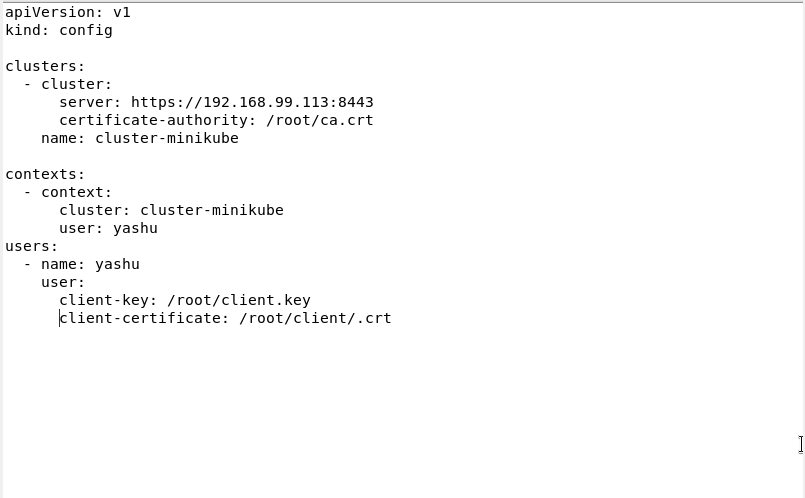
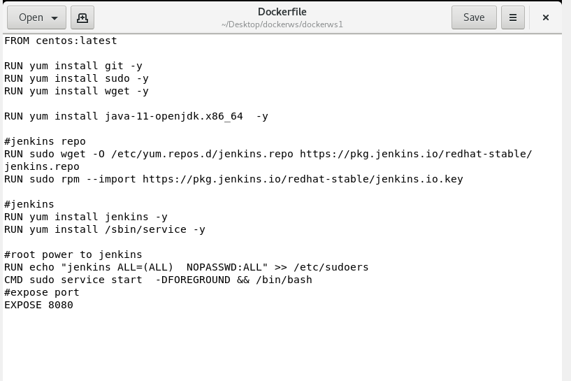
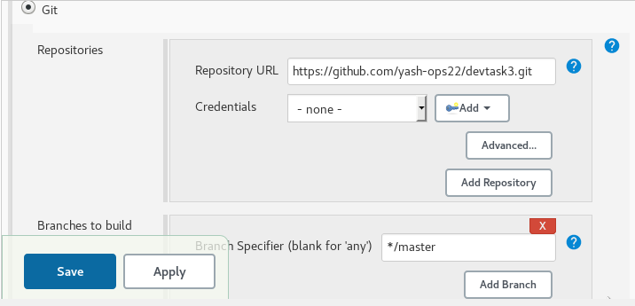
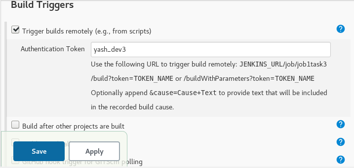
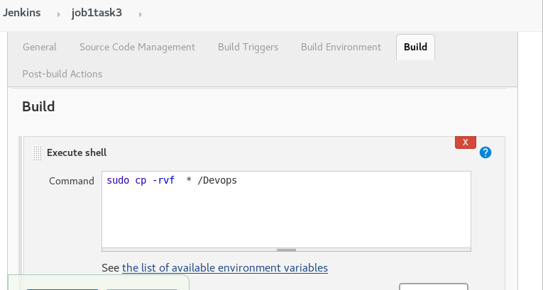
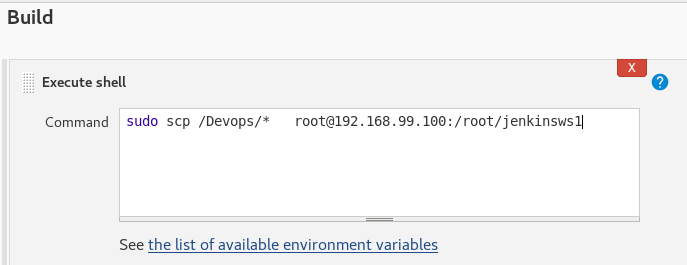
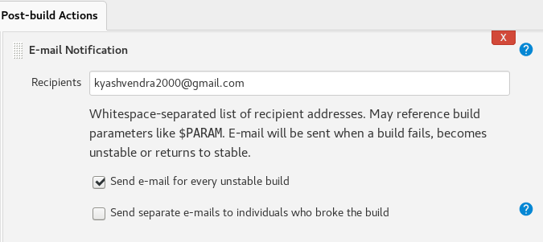

# Task 3: DevOps Assembly Lines 

1. Create container image that’s has Jenkins installed using
   dockerfile  Or You can use the Jenkins Server on RHEL 8/7
2. When we launch this image, it should automatically starts 
   Jenkins service in the container.
3. Create a job chain of job1, job2, job3 and  job4 using 
   build pipeline plugin in Jenkins 
4. Job1 : Pull  the Github repo automatically when some developers
   push repo to Github.
5. Job2 : 
    1. By looking at the code or program file, Jenkins should 
    automatically start the respective language interpreter
    installed image container to deploy code on top of Kubernetes
    ( eg. If code is of  PHP, then Jenkins should start the container 
    that has PHP already installed )
    2.  Expose your pod so that testing team could perform the testing on 
    the pod
    3. Make the data to remain persistent ( If server collects some data 
    like logs, other user information )
6.  Job3 : Test your app if it  is working or not.
7.  Job4 : if app is not working , then send email to developer with error
    messages and redeploy the application after code is being edited by
    the developer.
    
# Technology used:
 
        1.Docker
        2.Jenkins
        3.Kubernetes
 
 
# Requirement:

We have to install kubectl command in our redhat vm and then configure the minikube in it. For this we have to tranfer three files in redhat and configure them with the config file.
     
            1. ca.crt
            2. client.key
            3. client.crt
            
Configuration file of kuburnetes:

# Step:1
Creating a container image using Dockerfile which has the jenkins installed.
we installed  required commands for the centos. We have to provde root powers to jenkins to operate  commands. Jenkins default port 
is 8080.

After creating the image we have to build the image from the dockerfile.
COMMAND: 
             
             docker build -t  yashu:v1 .
         
Then running the container image with the command 
       
         docker run -it -p 8181:8080 --name osjenkins  yashu:v1
         

After running the image we can start the jenkins service.

# Step:2

Creating first Jenkins job which will download the code from the Github.
Whenever any code is pushed into the github jenkins job 1 will automatically 
download the code with the git  hook triggers. 

We provide tokens for the triggers 

This code will be copied inside the container in the folder provided.

# Step:3

In the Jenkins Job 2 the code of file from the container will be transfered or copied to RHEL 8 Virtual Machine.

# Step:4

Creating a third Jenkins job which will check the type of code and launch the same container pod. It will check the type of file or language interpreter with the extension of the file. After checking the code it will deploy the pods of the same lnguage interpreter.
Here the pod is launched on the top of Kubernetes which will monitor the pods and will again launch the pods if it fails or crashes.

# Step:5

This  Jenkins Job will check the  deployed pod for errors. If there is any error in the deployment an email will be sent to the mentioned email account. 

Before doing this we have to configure emails in the Jenkins configuration else email won't work.

# We are at the end of the task.
# Thank You for Reading it!!

